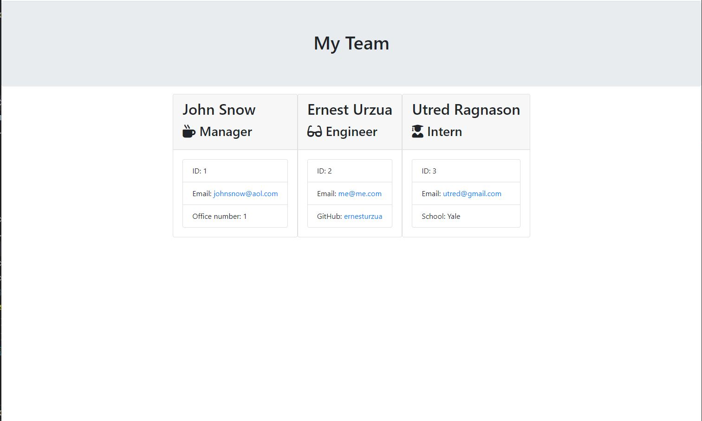

# Template Engine
## Application specifications
- must create 3 types of employees
  - Manager
  - Engineer
  - Intern
- each employee has 1 unique attribute associated with them
- must generate html page dynamically.
- must pass all tests in test folder

## Bonus

* Use validation to ensure that the information provided is in the proper expected format.

* Add the application to your portfolio.

